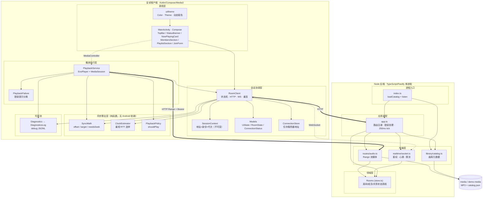
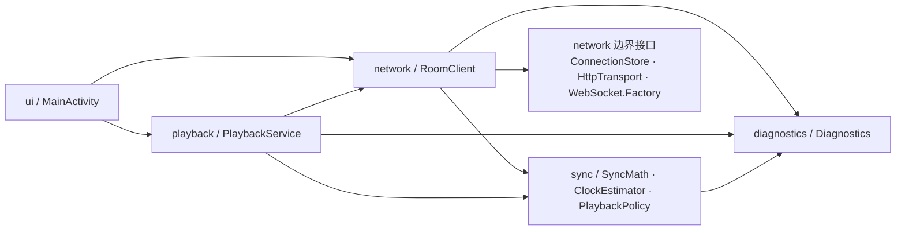
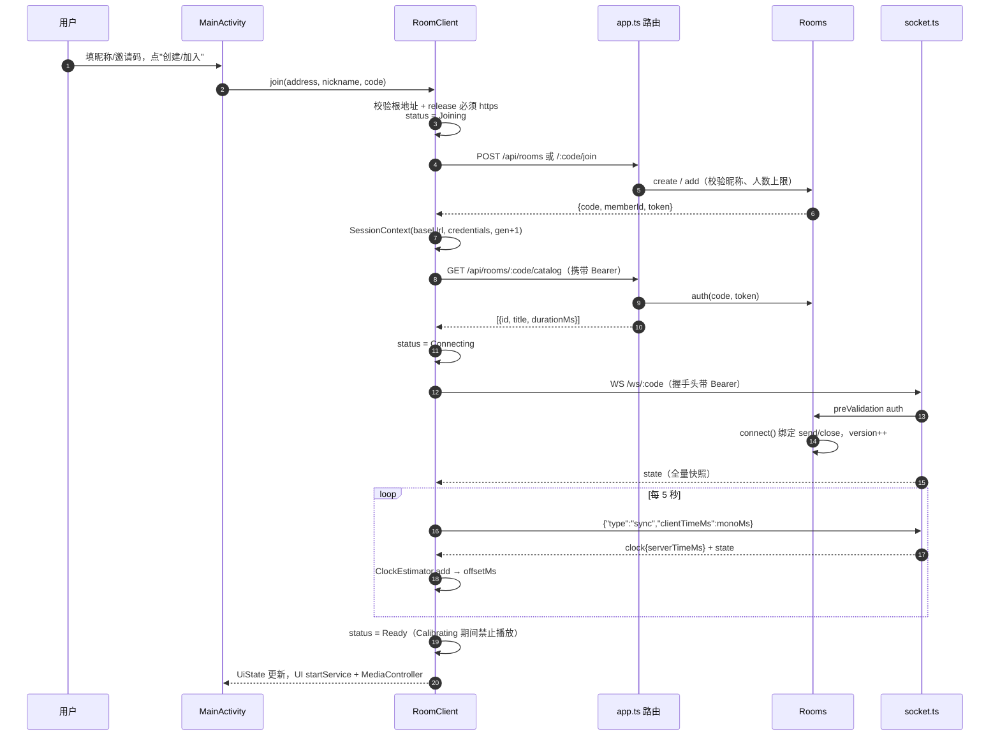
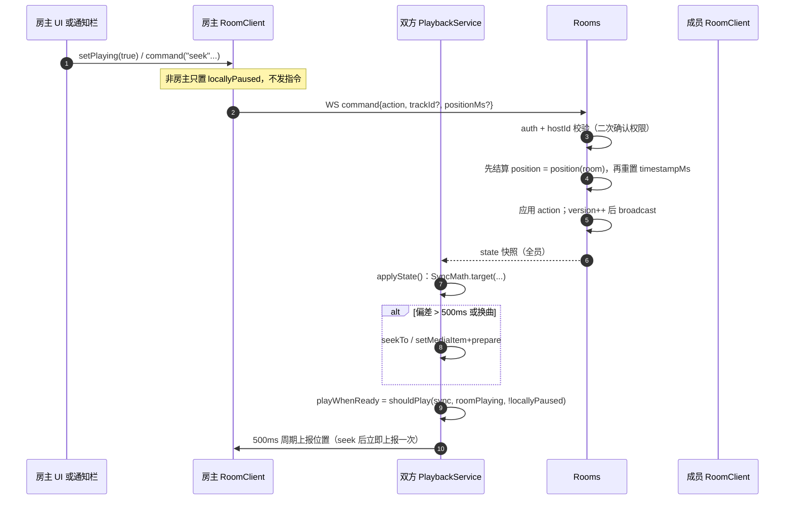
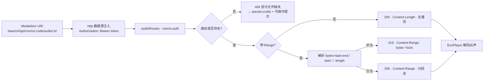
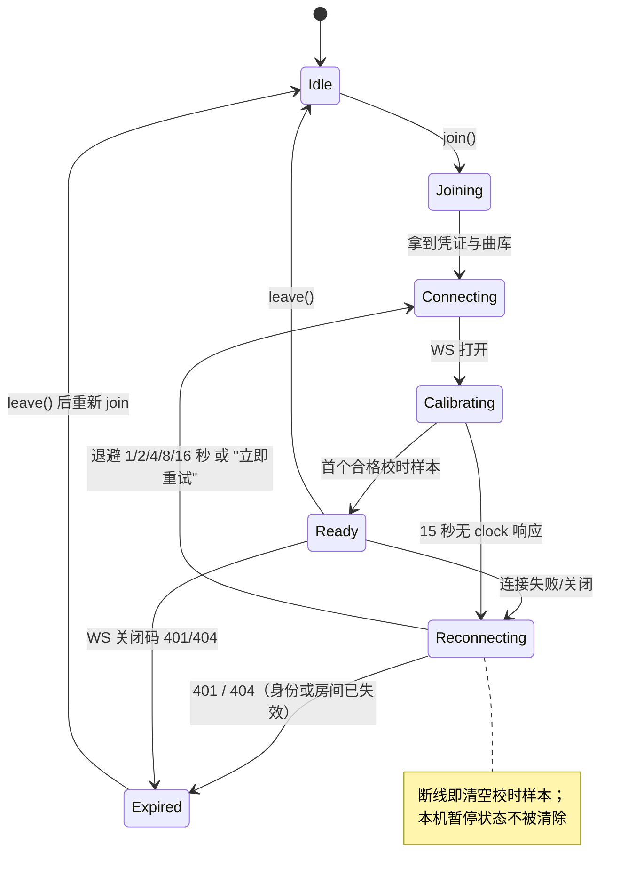
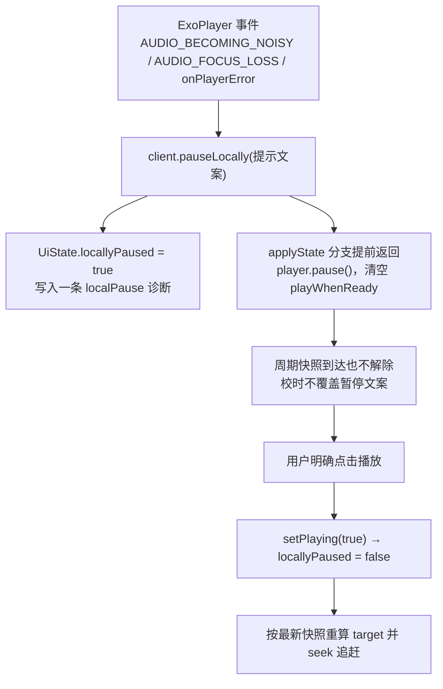
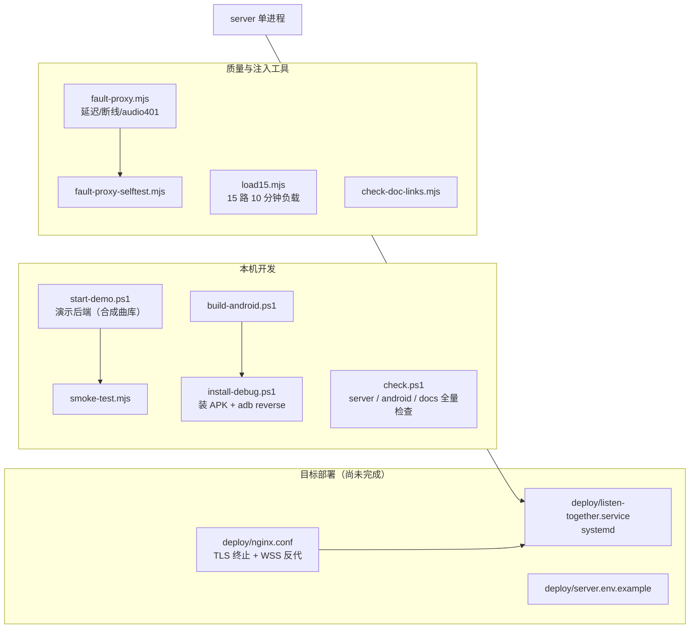

# 系统架构设计

建档日期：2026-09-22
依据：`android/app/src`、`server/src`、`docs/protocol.md` 实际代码。
验收进度以 [verification.md](verification.md) 为准，模块细节见 [模块文档索引](modules/README.md)。

本文描述三层——**安卓客户端、Node 后端、共享曲库资源**——的分层结构、模块职责与边界、依赖方向，以及六条端到端数据流路径。
所有结论均可回溯到具体源文件；若代码变动而本文未同步，以代码为准并请回填本文。

---

## 1. 系统全景

一句话概括：**服务端是共享播放状态的唯一真相来源，手机只负责"按服务端时钟把播放器摆到正确位置"**。
任何成员都不能绕过服务端改写房间状态；任何本机中断（音频焦点、耳机拔出、音频错误）都不能被服务端快照自动覆盖。



### 1.1 分层职责一句话

| 层 | 职责 | 明确不做 |
|---|---|---|
| 表现层 | 渲染 `UiState`，把用户手势翻译成 `RoomClient`/`MediaController` 调用 | 不持有跨会话业务状态、不直接算播放进度 |
| 会话协调层 | 会话生命周期、代次隔离、状态机、校时驱动、发布 `UiState` | 不碰 ExoPlayer、不认识 `PlaybackService` |
| 同步算法层 | 时钟偏移与目标进度的纯计算 | 不依赖 Android 框架、不发网络请求 |
| 播放执行层 | 持有 ExoPlayer/MediaSession，执行校准与 seek | 不自行决定"该不该播"（由 `PlaybackPolicy` 裁决） |
| 后端领域层 | 房间/成员/播放状态的唯一真相 | 不感知 UI、不信任客户端上报的位置 |
| 后端传输层 | 鉴权、序列化、限流、心跳、Range | 不修改房间语义，只调用 `Rooms` |

---

## 2. 模块职责与边界

### 2.1 安卓侧

| 模块 | 入口 | 职责 | 边界/替换点 |
|---|---|---|---|
| 应用宿主 | `ListenApplication` | 进程级创建 `DiagnosticsLog` 与 `RoomClient` 单例 | 唯一装配点 |
| UI | `MainActivity` (约 480 行) | Compose 渲染 + MediaController 生命周期；按 `credentials` 是否为 null 切换入房页/房间页 | 仅依赖 `RoomClient.state` 与 `client.command/retry/leave` |
| 会话核心 | `network/RoomClient` (306 行) | 入房、拉曲库、WS 连接/重连、校时循环、`UiState` 发布、代次管理 | 六个注入边界：`store`/`diag`/`monoMs`/`transport`/`wsFactory`/`mainDispatcher` |
| 会话身份 | `network/SessionContext` | 不可变三元组（地址、凭证、代次） | token 只存内存，不落盘、不写日志 |
| 状态模型 | `network/Models` | `UiState`、`RoomState.parse`、`ConnectionStatus` 七态枚举 | `busy`/`connected` 由 `status` 派生，不再独立维护布尔 |
| 地址存储 | `network/ConnectionStore` | 仅持久化 `baseUrl` | 令牌一律不存 |
| 校时 | `sync/ClockEstimator` | 8 样本、45 秒有效期、RTT ≤ 1500ms 中选最短者 | 断线/退出必须 `clear()` |
| 时间数学 | `sync/SyncMath` | `offset`/`target`/`needsSeek(>500ms)` | 纯函数，单位毫秒 |
| 播放裁决 | `sync/PlaybackPolicy` | `synchronized && roomPlaying && !locallyPaused` | 本机中断优先级最高 |
| 播放服务 | `playback/PlaybackService` (177 行) | ExoPlayer + MediaSession + `applyState()` 校准、`ForwardingSimpleBasePlayer` 拦截控制 | 只操作底层 player，避免回发循环 |
| 失败分类 | `playback/PlaybackFailure` | 401/404 给可操作文案，其余保留错误码 | 纯字符串决策，便于 JVM 单测 |
| 诊断 | `diagnostics/DiagnosticsLog` | debug 才生效的 JSONL，20MB / 60 分钟封顶 | 不写令牌；release 为空操作 |

### 2.2 后端侧

| 模块 | 入口 | 职责 | 关键约束 |
|---|---|---|---|
| 进程入口 | `src/index.ts` | 解析 `MEDIA_DIR` 加载曲库、`buildApp`、`listen`、`SIGINT/SIGTERM` 优雅关闭 | `MEDIA_DIR` 默认上级 `media` |
| 应用装配 | `src/app.ts` | 注册 rate-limit/websocket/错误处理器、HTTP 路由、WS 路由、`/health` 计数、250ms `tick` | bodyLimit 4KiB；关闭原始请求日志以免泄漏 Authorization；事件经 `EventSink` 注入 |
| 房间领域 | `src/rooms/store.ts` | `create/add/auth/connect/command/leave/tick/broadcast/position/snapshot/roomsOf/onlineMembers` | 单进程内存 `Map`；≤100 房间、≤15 成员、同 IP 活跃房间 ≤3 |
| 实时通道 | `src/realtime/socket.ts` | WS 握手鉴权与握手限连、`sync`/`command` 分发、15 秒 ping、20 msg/s 限流、慢客户端关闭、连接计数 | maxPayload 4KiB；写缓冲 >128KiB 关闭（1013 slow client）；握手同令牌+IP 10 秒 5 次 |
| 限流器 | `src/realtime/limits.ts` | 单进程固定窗口计数器（内存 Map，键数上限 4096） | 供握手限连使用；无外部依赖 |
| 事件出口 | `src/events.ts` | `ServerEvent`/`EventSink` 类型与安全红线 | 只带房间码/成员 ID/来源 IP，禁止令牌与昵称 |
| 音频传输 | `src/routes/audio.ts` (25 行) | Bearer 鉴权后按 Range 返回 200/206，非法范围 416 | `Cache-Control: private, no-store`；不接受客户端路径 |
| 曲库加载 | `src/library/catalog.ts` | 校验 `catalog.json`、过滤非法 ID、`realpath` 阻断目录穿越、读取 MP3 时长 | 只允许曲库目录内的 `.mp3` |

### 2.3 服务端合法性常量（唯一出处）

- 房间上限 100、成员上限 15（含重连宽限中的成员）、**同一来源 IP 活跃房间上限 3**（空房回收即释放）。
- 房主离线 **60 秒** 后转移给最早在线成员；成员离线 **60 秒** 剔除；全员离线 **300 秒** 删除房间。
- 创建/加入按路由限流 30 次/分钟；WS 消息 20 条/秒；**WS 握手同令牌+来源 IP 10 秒 5 次**（超出 429 拒绝升级）。
- `tick` 每 250ms 结算一次进度，负责自动切歌（固定歌单顺序，最后一首结束停止）。

---

## 3. 依赖规则



硬规则（违反会引入真实缺陷，见 [开发陷阱清单](development-pitfalls.md)）：

1. **单向下行**：UI 与播放服务都依赖会话层，会话层**不依赖**任何上层。`RoomClient` 通过 `attachStateObserver(callback): Int?` 通知，`PlaybackService` 被动收回调。
2. **无环**：播放服务不再回写除"房主控制指令"以外的任何共享状态；`applyState()` 只操作 `player`，不触发再次 `command`，避免回发循环。
3. **算法层零框架依赖**：`sync` 包不 import Android 类，因此可直接在 JVM 单测覆盖（26 项单测中大部分落在这里）。
4. **代次隔离**：任何跨会话的清理动作（取消任务、`detachStateObserver`、`leave`）必须携带创建时捕获的 `generation`，比对通过才执行。
5. **传输层不越权**：HTTP/WS 只调用 `Rooms`，不直接改 `room` 字段；所有权限校验（`auth` + `hostId`）在 `Rooms` 内二次确认。
6. **时钟域隔离**：手机用 `elapsedRealtime` 单调时钟，服务器用 `Date.now()`，两者只通过 `offset` 桥接，禁止直接相减。

依赖矩阵（行依赖列）：

| 依赖方 \ 被依赖方 | ui | network | sync | playback | diagnostics | rooms(后端) |
|---|---|---|---|---|---|---|
| ui | — | ✓ | — | ✓（MediaController） | — | — |
| network | ✗ | — | ✓ | ✗ | ✓ | ✓（HTTP/WS） |
| sync | ✗ | ✗ | — | ✗ | ✗ | — |
| playback | ✗ | ✓ | ✓ | — | ✓ | ✓（音频 HTTP） |
| diagnostics | ✗ | ✗ | ✗ | ✗ | — | — |

---

## 4. 端到端数据流

### 4.1 入房与校时（冷启动）



关键点：join 失败会**用入房时捕获的上下文**回滚发送 DELETE，即使地址已变更也不会把请求发到别的服务器；`CancellationException` 原样重抛不吞掉。

### 4.2 房主控制（play / pause / select / seek）



`Rooms.command` 的"先结算旧进度再更新时间基准"是暂停/恢复不累计旧时间的关键；25ms 级的 tick 负责终点自动切歌。

### 4.3 音频拉取（带鉴权的 Range 流）



注意路径：音频请求由**播放服务**独立发起，与 WS 通道分离；令牌失效时这条链路返回 401，由 `PlaybackFailure` 归类为"登录已失效，请退出房间后重新加入"。

### 4.4 时钟同步与进度推算

```
手机单调时钟 (elapsedRealtime)
  ├─ sent/received ──► SyncMath.offset = serverTime - (sent + received)/2
  │                    ClockEstimator 在 RTT ≤ 1500ms 的样本中取最短者
  ├─ serverNow = elapsedRealtime + offset
  └─ SyncMath.target = clamp(positionMs + (playing ? serverNow - timestampMs : 0), 0, durationMs)
                        └─ 偏差 > 500ms 才 seek（needsSeek）
```

时钟源选择的原因写在 `ClockEstimator` 注释里：网络排队会单向拉长延迟，使中点估计失真，最短往返样本受排队影响最小。

### 4.5 断线重连与身份失效



退避上限由 `1000L shl attempt.coerceAtMost(4)` 给出（1→16 秒），一个会话同时至多一个 socket 与一个重连任务。

### 4.6 本地中断（音频焦点 / 耳机拔出 / 音频错误）



这条路径保证：**其他人继续听，本机静音等待人工确认**。房主同样适用——`PlaybackPolicy.shouldPlay` 把 `locallyPaused` 放在最高优先级。

---

## 5. 关键不变式

编写改动时下列条目不可破坏，均有真机或单测证据：

1. **服务端是播放唯一来源**：客户端不上报自己的播放位置去覆盖房间状态。
2. **明确点击播放才能解除本机暂停**：周期校时与快照不得替用户恢复外放。
3. **代次隔离**：旧会话的迟到回调、旧 PlaybackService 的销毁清理，一律不得影响新会话。
4. **退出顺序固定**：作废旧代次 → 取消任务 → 关闭 Socket → 用旧上下文尽力发 DELETE；本地不等结果。
5. **令牌不落盘、不进日志**：只有内存与请求头；诊断日志只含房间码/曲目 ID/version。
6. **缓冲期间不 seek**：`STATE_BUFFERING` 位置不可信，回到 `READY` 立即重校准。
7. **单进程单实例**：房间在内存态，不可用多 worker；重启需重建房间。
8. **`positionMs`/`timestampMs` 语义**：`positionMs` 是基准进度、`timestampMs` 是基准服务端时刻，二者必须同时写入。

---

## 6. 工程与部署视图



- 演示曲库 `demo-media` 与正式曲库 `media` 分离，互不影响。
- 云端部署（M4）当前**因 SSH 公钥登录被拒而挂起**，详见 [deployment.md](deployment.md) 第 0 节。
- 故障注入代理位于客户端与后端之间，可在无手机条件下自测延迟/断线/音频 401。

---

## 7. 代码位置索引

| 关注点 | 文件 |
|---|---|
| UI 装配与意图转发 | `android/app/src/main/java/com/listentogether/app/MainActivity.kt` |
| 会话状态机、重连、校时驱动 | `.../network/RoomClient.kt` |
| 不可变会话身份 | `.../network/SessionContext.kt` |
| 状态模型 | `.../network/Models.kt` |
| 同步算法 | `.../sync/SyncMath.kt`、`ClockEstimator.kt`、`PlaybackPolicy.kt` |
| 播放与媒体会话 | `.../playback/PlaybackService.kt`、`PlaybackFailure.kt` |
| 诊断 | `.../diagnostics/DiagnosticsLog.kt` |
| 应用装配 | `.../ListenApplication.kt` |
| 后端装配与路由 | `server/src/app.ts`、`server/src/index.ts` |
| 房间领域 | `server/src/rooms/store.ts` |
| 实时通道 | `server/src/realtime/socket.ts` |
| 握手限流器 | `server/src/realtime/limits.ts` |
| 排障事件与安全红线 | `server/src/events.ts` |
| 音频 Range | `server/src/routes/audio.ts` |
| 曲库加载与校验 | `server/src/library/catalog.ts` |
| 协议定义 | `docs/protocol.md` |

## 8. 已知边界

- 房间/成员状态全内存：**不支持**水平扩容、多实例或热升级。
- M2 双机同步验收因缺少第二台手机挂起，音频同步精度尚无两台设备的对比数据（仅有本机 TV/Load empirical 证据）。
- 曲库为管理员手工维护，不含账号、聊天、上传与第三方音乐平台接口。
