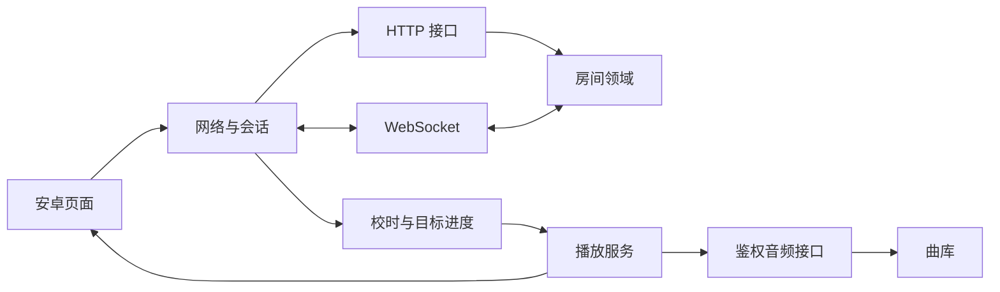

# 模块文档索引

这些说明于 2026-09-21 建档，进度入口于 2026-09-22 同步；实际验收以 [验收记录](../verification.md) 为准。“当前实现”是已有行为；“下一阶段”均为待开发。
路线图与验收标准见 [主计划](../next-development-plan.md)，统一规范见 [文档与注释规范](../development-standards.md)。

整体分层、模块边界与端到端数据流见 [系统架构设计](../architecture.md)；本索引按模块给出职责、流程、接口、异常与验收细节。

| 模块 | 主要入口 | 文档 |
|---|---|---|
| Android 界面与应用入口 | MainActivity、ListenApplication、UiState | [01 Android UI](01-android-ui.md) |
| Android 网络与会话 | RoomClient、Credentials、RoomState | [02 网络与会话](02-client-session.md) |
| Android 播放服务 | PlaybackService、MediaSession | [03 播放服务](03-playback-service.md) |
| 校时与同步算法 | ClockEstimator、SyncMath、PlaybackPolicy | [04 同步](04-synchronization.md) |
| 后端房间领域 | Rooms、Room、Member | [05 房间](05-room-domain.md) |
| 后端启动与 HTTP | index.ts、app.ts | [06 HTTP](06-http-api.md) |
| WebSocket 通信 | realtime/socket.ts | [07 实时通信](07-websocket.md) |
| 曲库与音频传输 | catalog.ts、audio.ts、media | [08 曲库与音频](08-library-audio.md) |
| 构建、脚本与部署 | Gradle、scripts、deploy | [09 部署](09-build-deployment.md) |
| 测试与诊断 | server/test、Android test、验收报告 | [10 测试](10-testing-observability.md) |

模块间的数据流：

共享播放状态由后端房间模块负责；本机暂停/音频焦点由播放器与本机会话负责，不能相互覆盖。

跨模块的开发陷阱与规避方法（编码、adb、UI 自动化、Compose、协程测试）见 [开发陷阱清单](../development-pitfalls.md)；踩到新坑必须回填该文档。

## 关键代码阅读顺序（原 learning.md，2026-09-24 并入）

1. server/src/rooms/store.ts：共享状态的唯一来源。先看 command 如何结算进度，再看 tick 的房主转移和曲终推进。
2. server/src/realtime/socket.ts：WebSocket 握手验证、校时和心跳；关闭旧连接时的引用比较避免重连竞态。
3. server/src/routes/audio.ts：为什么播放进度跳转需要 HTTP Range，及边界验证。
4. android/.../sync/SyncMath.kt：单调时钟、网络往返中点与播放进度公式。
5. android/.../network/RoomClient.kt：协程、状态流、重连代次，及过期回调丢弃。
6. android/.../playback/PlaybackService.kt：播放器属于服务而非页面，通知栏控制如何经过房间权限。
7. android/.../MainActivity.kt：Compose 状态驱动界面；不在 UI 内维护第二套播放器。

关键代码注释说明设计原因，变量/接口名称采用常用英文。先读 [protocol.md](../protocol.md)，再对照测试修改参数练习。
不要把自定义音频从服务器逐帧实时转发：首版各客户端直接读取同一个 MP3，WebSocket 只发送状态。
