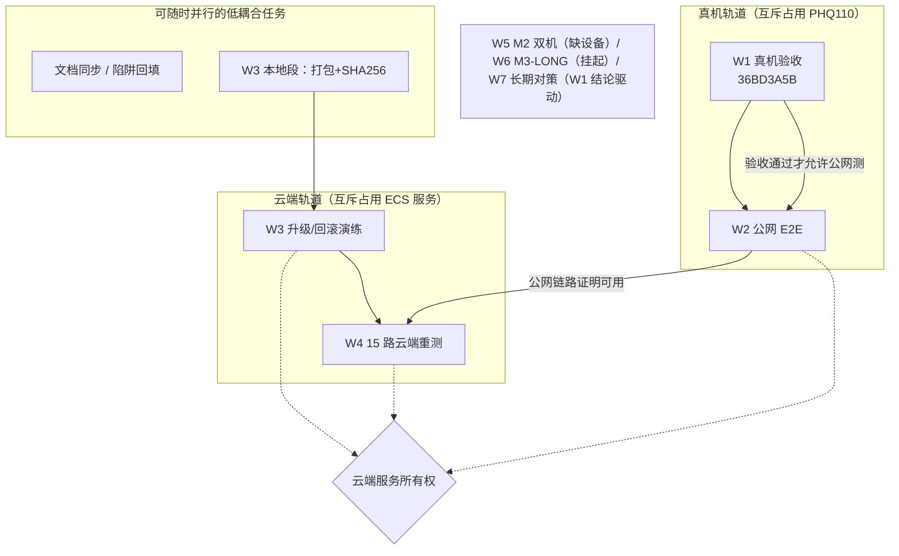

# 当前阶段并行开发推进方案

制定日期：2026-09-23（状态截至 verification.md 2026-09-23 晚，TLS 路线 A 决策之后）
输入文档：[verification.md](verification.md)（进度唯一事实来源）、[next-development-plan.md](next-development-plan.md)、[execution-plan.md](execution-plan.md)、[handover-2026-09-23.md](handover-2026-09-23.md)、[deployment.md](deployment.md)、[development-pitfalls.md](development-pitfalls.md)、[architecture.md](architecture.md) 与 10 份模块文档。
性质：**推进方案，不是测试报告**；执行结果仍只登记在 verification.md。本文回答四个问题：现在有什么可做、哪些能并行、哪些必须串行、冲突怎么协调。

---

## 1. 当前状态快照（模块 × 状态）

| 模块（见[架构文档](architecture.md)） | 当前状态 | 关键证据 |
|---|---|---|
| 01 Android UI | 已实现；简洁 UI + 优化批次真机验证通过；**卡顿修复版（36BD3A5B）含进度条端点改动待真机目视** | [ui-refresh](test-results/2026-09-23-ui-refresh/README.md)、[ui-optimize](test-results/2026-09-23-ui-optimize/README.md) |
| 02 网络与会话 | 已实现并真机验证（状态机/代次隔离/重连/401）；无待办改动 | m1/m3-auth-recheck 记录 |
| 03 播放服务 | **分级纠正 + SmoothRenderers 刚落地，真机验收未做** | [交接单第五节](handover-2026-09-23.md) |
| 04 同步算法 | SyncMath 分级纠正已落地（45 项单测通过）；`speed` 纠正待真机确认 | SyncMathTest 3 组新用例 |
| 05/06/07 后端房间/HTTP/WS | 已实现并稳定；本轮无必须改动 | 首次部署 13/13 |
| 08 曲库与音频 | 已实现；云端 5 首 192k；曲库工具链就绪 | deployment.md 第 6 节 |
| 09 构建/部署 | 云端单实例运行中（0.0.0.0:3000，release 20260922-2159）；**升级/回滚演练未做** | m4-first-deploy 记录 |
| 10 测试与诊断 | 45 项安卓单测 / 7 项后端测试 / Lint 0；诊断分析脚本就绪 | verification.md |

待办全景（来自 verification「尚待验收」+ 交接单第六节）：

| 编号 | 事项 | 状态 |
|---|---|---|
| T1 | 卡顿修复（36BD3A5B）真机验收，5 项清单 | 待执行 |
| T2 | M4 真机公网 E2E（建房→播放） | 具备重测条件（OOM 已排除，恢复入口=陷阱 3.4） |
| T3 | M4 升级/回滚演练 | 首次部署仅具备停用/恢复条件，未记回滚通过 |
| T4 | LOAD-15 云端公网重测 | 本地已通过；云端待测 |
| T5 | M2 双机同步 | **阻塞**：缺第二台手机 |
| T6 | M3-LONG 60 分钟+30 分钟息屏 | **挂起**：用户指示（demo-hour 与采样脚本已备） |
| T7 | UI 遗留目视项（分享面板/非房主 Snackbar/通知权限延迟/暗色冷启动/大字体/平板限宽） | 随下次真机批次顺带 |
| T8 | TLS/域名正式化 | **用户已决策路线 A**：试用期内维持 `http://8.166.126.136:3000`；转正式实例备案或迁香港时再解决 |

---

## 2. 共享资源与硬约束（并行可行性的物理边界）

| 资源 | 约束 | 出处 |
|---|---|---|
| 真机 PHQ110（唯一） | 所有真机任务**互斥**；无线 adb 需亮屏 + 单命令块完成 connect/reverse（陷阱 2.7/2.8） | 陷阱 2.7、2.8 |
| 云端 ECS（1.7Gi+2G swap，单实例内存态） | 重启即清空房间；**严禁同机跑 VS Code Remote/重负载**（三次全局 OOM 教训）；LOAD-15 与升级演练不能同时进行 | 陷阱 8.5、2.3 |
| 公网出网流量 | 大陆地域免费 20GiB/月；LOAD-15 云端 10 分钟 ≈ **2.2GB（约月额度 11%）** | working memory/verification |
| APK 版本 | 当前 36BD3A5B（45 单测）**未真机验收**；真机验证过的最新版是 169018AE。真机/公网结论必须与 hash 绑定，改码即换锚 | verification.md |
| 共享文档 | verification.md、AGENTS.md、模块文档、陷阱清单被所有工作流写入 | 开发规范 |
| 后端代码 | 当前**无必须的后端改动**——并行方案据此不设后端开发轨道，避免与云端验证互相污染 | 全文档 |

---

## 3. 工作流划分

### W1 · 真机验收批次（P0，串行占用真机）

- **范围**：T1 全部 5 项（关省电听感复测 → 开省电变速观察 → 自动切歌出声 → 进度条端点目视 → 结论回填），顺带 T7 可目视项（暗色冷启动、大字体）。
- **涉及模块**：03 播放服务、04 同步、01 UI。
- **输入**：APK 36BD3A5B（已装机）；无线 adb 通道（亮屏 → `adb mdns services` 取调试端口 → `connect-wireless.ps1`）；本地演示后端（demo-hour/catalog 已就绪，改过 catalog 需重启）。
- **输出**：诊断 JSONL 中 `correction="seek"→"speed"` 的分布统计；verification.md 补真机结论；陷阱清单按需回填。
- **开始条件**：手机可亮屏配合 + `adb shell settings get global low_power` 可读取。
- **验收判据**：交接单第五节 1–4 条 + 陷阱 9.2（听感连续性，连采两次 media_session 位置速率 ≈1x）。

### W2 · M4 公网 E2E（P0，依赖 W1）

- **范围**：T2。用 **W1 验收通过后的同一 APK（36BD3A5B）**，经 `http://8.166.126.136:3000` 完成 创建房间 → 选歌 → 播放 → 暂停 → 拖动 → 切歌 → 退出；如条件允许记录公网 RTT 与校时样本。
- **涉及模块**：01/02（客户端）、05/06/07/08（后端链路）。
- **输入**：云端入口公网可达（已实测 200）；陷阱 3.4 恢复路径（`run-as rm` 删 connection.xml 或手机**手动**填地址——不再尝试 Compose 输入自动化硬刚）。
- **输出**：`docs/test-results/<日期>-m4-public-e2e/README.md`；verification.md「公网验证」勾选。
- **开始条件**：W1 通过（否则 E2E 失败无法区分"新代码缺陷"与"网络问题"）；云端服务 active 且近期无重启计划。
- **边界**：单机单房间；M2 双机数据点仍缺设备，不并入本轮。

### W3 · M4 升级/回滚演练（P1，两段式；本地段可与 W1 并行）

- **范围**：T3。产生一个"新版本"release 并演练**真实回滚**（当前只有 release 20260922-2159，首次部署未记回滚通过）。
  - 本地段（不动云端）：`package-deploy.ps1` 打新包（同代码新时间戳即可）→ 产出 tar.gz + SHA256 清单。
  - 云端段（独占服务，见第 5 节规则）：上传 → releases/<新ID> 解包构建 → 按 [deployment.md 第 5 节](deployment.md) 切符号链接 → restart → health/13 项抽查 → **回滚到 20260922-2159** → 再验证。
- **涉及模块**：09 部署；后端 05–08 只做回归抽查。
- **输入**：SSH `aliyun` 通；本地构建产物；`current-version.txt` 机制。
- **输出**：回滚演练记录（升级成功 + 回滚成功 + 两次重启丢房间的如实标注）；新 release 保留在服务器，供后续真实升级。
- **开始条件**：与 W2/W4 时间片错开（两次 restart 必清房间）。

### W4 · LOAD-15 云端公网重测（P1，依赖 W2）

- **范围**：T4。15 路 × 600s 公网直连 `http://8.166.126.136:3000`，`load15.mjs`（播放速率模型），记录吞吐/失败率/服务端资源。
- **涉及模块**：08（音频）、06/07（HTTP/WS 承载）、09（观察）。
- **输入**：**前置准备——demo-load.mp3（11 分钟 192k）需上传云端曲库**（`add-media.ps1` + `-Restart`，重启清房间，须与 W2/W3 错开）；流量预算 ≥2.5GB。
- **输出**：云端 15 路记录（对照本地 2.873Mbps 基线）；若公网带宽不足（出口 ~8Mbps > 需求 2.88Mbps，理论可行），降级预案=曲库转 128k（脚本已就绪）。
- **开始条件**：W2 通过（公网链路已被真机证明可用）；执行期间服务器只做轻量 ssh 观察（陷阱 8.5）。

### W5 · M2 双机同步（阻塞，不动）

- 恢复条件：第二台真实安卓手机到位。**额外注意**：`speed` 分级纠正进入 95%≤500ms 指标的统计口径（handover 第六节 5），恢复时先补测量方案再执行。挂起期间不调整同步参数。

### W6 · M3-LONG（P2，用户指示挂起）

- 恢复条件：用户给出 ≥70 分钟连续测试窗口。物料已备（demo-hour 70 分钟 + `m3long-sample.ps1`）。执行注意 DiagnosticsLog 60 分钟窗口不可拼接。

### W7 · 长期对策与收尾（P2，条件触发，低耦合）

- 渲染欠载长期对策（省电提示 UI / offload 评估）——**由 W1 结论决定是否立项**，若立项属 Android 代码改动，须重新走"构建 → 单测 → 新 hash → 真机"锚定流程。
- TLS 正式化（转包年包月备案 / 迁香港）：用户决策 + 付费，nginx 80/443/8443 配置已备好可复用。
- 小项：8443 安全组规则可关闭（不影响功能）；strings.xml 抽取单独立项。
- 文档轨道：任何工作流结束时的 verification/AGENTS/模块文档同步 + `check-doc-links.mjs` + git 提交（push 用 `git -c http.proxy=http://127.0.0.1:7890 push origin main`）。

---

## 4. 依赖与并行关系



**并行点**：真机轨道与云端轨道的唯一耦合是"云端服务稳定性"，而非代码。因此可行的并行组合：
1. W1（真机）∥ W3 本地段（本地打包构建）——零共享资源，推荐。
2. W4 的 10 分钟执行期间 ∥ 纯文档整理（不碰云端、不碰 verification 以外的代码文件）。
3. W5/W6 挂起项的物料准备（已全部完成，无剩余可并行项）。

**不可并行**：W2 与 W3 云端段 / W4 三者共享云端服务，任意时刻只允许一个在工作（见第 5 节）。

---

## 5. 串行关键路径与冲突协调

### 5.1 关键路径（决定 M4 收官速度）

```
W1 真机验收 ──→ W2 公网 E2E ──→ W4 15 路云端重测 ──→ M4 门槛达成
                    ↑                    ↑
              （云端可用）        W3 升级/回滚演练（与其串行，建议先于 W4）
```

理由：W4 是 M4 最后一个量化门槛，必须在"已知良好的服务版本"上跑（先 W3 确认回滚可靠，再 W4 固化基线）；W2 必须先于 W4，否则公网链路本身未证明，重测数据无法归因。

### 5.2 冲突清单与协调规则

| # | 冲突 | 风险 | 协调规则 |
|---|---|---|---|
| C1 | W2 / W3 云端段 / W4 同时操作云端服务 | 重启清房间打断 E2E；重测中途升级直接失败 | **云端服务所有权时间片**：任一工作流开始前在响应中声明占用，结束（含 health 复核）后释放；切换间隔 ≥5 分钟观察期 |
| C2 | 真机单台 | W1/W2 及未来 W5/W6 互斥 | 真机任务合并为"批次"执行（一次连接完成 W1+W2），减少无线通道重连次数（端口每次轮换） |
| C3 | verification.md / AGENTS.md 多写者 | 并行会话互相覆盖进度记录 | 单写者原则：进度文档只在收尾时由当轮会话一次性写入；中间发现记录进各自 test-results，最后汇总 |
| C4 | APK hash 漂移 | E2E 结果无法归因（代码 vs 网络） | **版本锚定**：W1+W2 全程 pin 36BD3A5B；W7 若改码，从新构建起所有真机结论重新关联新 hash |
| C5 | 云端曲库变更需重启（时长缓存） | 与 C1 叠加 | demo-load 上传并入 W4 的云端占用时间片内（上传→重启→确认→开测，一气呵成） |
| C6 | 流量 20GiB/月 | W4 试跑+正式两轮 ≈ 4.5GB（22%） | 先 60 秒短试跑确认 15 路全 206，再跑完整 600s；预留失败重跑一次的预算 |
| C7 | ECS 内存 OOM（陷阱 8.5） | 全端口超时误判为"服务挂了" | W4 执行期间 ssh 仅限 `free -m`/`journalctl -n` 轻量观察；任何会话不得在服务器起 IDE/构建/转码 |
| C8 | 后端重启丢房间（内存态） | 用户正在试用的房间被清 | 涉及 restart 的动作（W3/W4/曲库）避开用户实际使用时段，执行前确认无活跃房间 |

---

## 6. 优先级排序与执行顺序

| 顺序 | 工作流 | 优先级 | 依赖 | 预估占用 | 退出判据 |
|---|---|---|---|---|---|
| 1 | **W1 真机验收批次** | P0 | 无（条件：无线 adb + 关省电） | 真机 30–40 分钟 | 交接单第五节 1–4 通过 + verification 回填 |
| 2 | **W2 公网 E2E** | P0 | W1 通过；云端可达 | 真机 15 分钟 + 记录 | 建房→播放→切歌全链路公网证据落 test-results |
| 3 | W3 本地段：打包（可与 1/2 并行） | P1 | 无 | 本地 5 分钟 | 新 tar.gz + SHA256 清单就绪 |
| 4 | **W3 云端段：升级+回滚演练** | P1 | 本地段；云端时间片 | 独占服务 ~20 分钟 | 升级成功 + 回滚到 20260922-2159 成功 + 两次 health 复核 |
| 5 | **W4 15 路云端重测** | P1 | W2 通过；demo-load 上传；流量预算 | 独占服务 ~30 分钟（含试跑） | 15 路 600s 全 206、零失败、吞吐/资源记录落档 |
| — | W5 M2 双机 | 阻塞 | 第二台手机 | — | 到位后按主计划验收 |
| — | W6 M3-LONG | P2 | 用户连续窗口 | 真机 70+ 分钟 | execution-plan 第 2 节判定 |
| — | W7 长期对策/TLS 正式化 | P2 | W1 结论 / 用户决策 | — | 各自单独立项 |

**一轮最短路径**（条件齐备时）：W1 → W2 →（W3 本地段早已并行完成）→ W3 云端段 → W4 → M4 四项门槛全部关闭，T1–T4 全部清零。此后项目剩余待办只有 W5/W6 两个外部条件触发的挂起项与 W7 可选项，可转入 0.2.0 收尾或试用反馈驱动的修复循环。

---

## 7. 维护约定

- 本文是**快照型方案**：每个工作流完成或状态变化时，由当轮会话更新对应条目并同步 verification.md；不在此处登记测试结果。
- 新任务出现时先做三件事：判断它占不占用真机/云端时间片、是否产生新 APK hash、要不要动后端代码——三者分别触发 C2/C4/C1 协调规则。
- 与[执行单](execution-plan.md)的关系：执行单定义"单个任务怎么做、证据长什么样"；本文定义"多个任务怎么排、谁先谁后、冲突怎么办"。两者冲突时以执行单的操作与证据要求为准。
