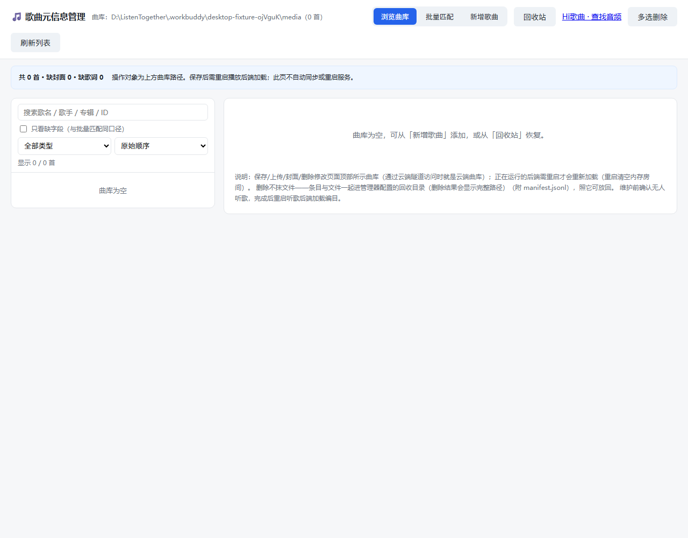
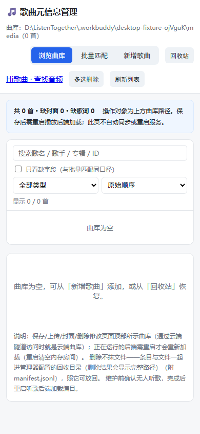

# 不依赖真机的开发与验收（2026-10-02）

按用户“尽可能完成不需要真机的任务”执行。本轮关闭本地专辑链路、媒体元数据回归、管理器删除/空库截图、服务端真实令牌失效，以及隔离 Linux/systemd 升级失败回滚；准备不带曲库的后端候选包。没有操作手机、MuMu、云端在产服务或真实曲库，没有提交/推送 Git，没有修改同步参数。

## 已完成

| 项目 | 结果与证据 |
|---|---|
| 专辑字段 | `loadCatalog` 非空手填优先、ID3 专辑兜底、缺失为 null。完整 catalog、search 与当前曲共用 `toSummary`，协议公开第 9 字段 `album`，revision 随其变化；不泄漏 path/size。真实 TALB 标签夹具和实际应用响应通过。 |
| 安卓媒体元数据 | `Track` 兼容旧响应缺字段、null/空串/错误类型；`TrackMetadata.kt` 为实际 Media3 MediaMetadata 设置 title/artist/albumTitle。歌手此前已有 setArtist，这轮将构造提取并补回归；换到无专辑曲不保留旧值。尚无本轮系统通知目视证据。 |
| 本机删曲与空库 | Chrome 真实界面取消/删除/删最后一首/回收站恢复，8/8；1280×1000 与 390×844 截图、无横向溢出、无未捕捉异常。空库编辑区修掉无歌可选时仍提示“从左侧选择”的问题，改为新增/恢复指引。 |
| Linux 下架与恢复 | WSL 原生 Linux 路径下，共享音频/封面/歌词最后引用删除与两曲恢复，3/3；三个共享文件 SHA256 一致，先删一曲不移文件，最后一曲才移三文件。部署手册 6.3 改用已有云端管理器，不再误写“没有工具”。生产云端删曲仍未执行。 |
| 真实令牌失效 | 主动退出与离线 60 秒清扫分别使旧 token 的 HTTP catalog/media 与真实 WS 升级返回 401；新 HTTP join 换发 token 后 HTTP/WS 恢复，房主不受影响。2 个集成测试，不是代理伪造 401。设备 Expired/rejoin 显示待真机。 |
| systemd 升级失败 | WSL 独立临时服务使用实际 dist、Node 24、生产 service 模板的 Restart/on-failure 与沙箱限制。坏 dist 与缺 node_modules 均 ExecMainStatus=1、NRestarts≥1；两次切回 good 后健康恢复，5/5。只写本机隔离目录，测试后临时 unit/账号/目录已清理；不是在产云端失败发布演练。 |
| 发布候选包 | `package-deploy.ps1 -ServerOnly` 排除 media/demo-media，包含 src/dist/test/锁文件、schema 生成脚本与协议/部署文档；Node 默认从 PATH 取，可显式 -NodePath。包内 SHA256 清单已校验，不上传云端。制品见 [delivery.json](delivery.json)。 |

固定本地制品：[debug APK](../../../deploy-artifacts/ListenTogether-desktop-041b4295.apk)（21,787,637 字节，`041b4295…`，未装机）；[纯后端候选](../../../deploy-artifacts/listen-together-server-0.1.0-20261002-013255.tar.gz)（142,792 字节，`22a58d03…`）；[SHA256 清单](../../../deploy-artifacts/SHA256SUMS-20261002-013255.txt)。

## 门禁与复跑

- 服务端 build + **74/74**，新增 metadata 2 + token-revocation 2；[服务端日志](server-tests.log)。
- Android 强制 cleanTest + **180 项 / 24 套件，0 失败/错误/跳过**、assembleDebug、Lint XML issue=0；[构建日志](android-build.log)、[JUnit](junit/)。末轮 Lint 任务为 UP-TO-DATE，不宣称强制重分析。
- 本机工具离线 **51/51**；[脚本日志](scripts-tests.log)。
- [浏览器结果](browser-delete.json) **8/8**、[Linux 回收结果](linux-library.json) **3/3**、[systemd 实测](systemd-failure.log) **5/5**。
- 本轮 APK、候选 tar、源码/编译产物 SHA256、环境及文档检查见 [delivery.json](delivery.json) 与 [source-hashes.json](source-hashes.json)。共享工作区已有聊天键盘并行改动；APK 按本轮固定 hash 登记，不以 HEAD 或上一装机包替代。
- Markdown 本地链接检查与 git diff --check 通过。链接检查原先误扫 `.workbuddy` 内下载的 Node 发行包 README/CHANGELOG，报发行包不带的源码文档；现排除 `.workbuddy`/`deploy-artifacts`，仍检查项目文档，保留 [首次检查日志](doc-links-first-attempt.log)。
- [独立候选包校验](package-verify.log)：tar 本体与包内全部文件 SHA256 通过；隔离解包后实际运行 schema 生成和 TypeScript 编译通过。依赖复用本机 node_modules，未冒充网络 npm ci 验收；[复跑脚本](package-verify.sh) 固定本次包名，下一版须改为对应制品。
- [真实曲库只读校验](real-catalog-readonly.json)：45 首均可加载，artist/album/cover/lyrics 各 45；不写 media。当前 APK 与固定副本 SHA256 一致，Android 源码最新修改早于 APK 写入，未使用并行任务后续包替换本轮证据。

在仓库根执行（`server/dist` 需已构建，Chrome 需已安装）：

```powershell
cd server
npm run build
npm test
cd ..
node docs/test-results/2026-10-02-desktop-tasks/browser-delete.mjs
powershell -NoProfile -ExecutionPolicy Bypass -File scripts/check.ps1 -Scope scripts
powershell -NoProfile -ExecutionPolicy Bypass -File scripts/package-deploy.ps1 -ServerOnly
node scripts/check-doc-links.mjs
```

Linux 脚本使用临时下载的 Node 24.21.0，未替换 WSL 现有 Node 18。压缩包来自 [Node 官方目录](https://nodejs.org/dist/v24.21.0/)，SHA256 与官方 SHASUMS 核对为 `fd8e59d5a511510f6a298afb548f18c7d2b1be404d8b4a27d94fbe49f56cb2d6`。复跑需 WSL Ubuntu 的 systemd 已运行，并先在 `.workbuddy/linux-node/` 放入该压缩包及解压 runtime；路径写在脚本顶部。

```powershell
wsl -d Ubuntu -u root --exec /mnt/d/ListenTogether/.workbuddy/linux-node/runtime/bin/node /mnt/d/ListenTogether/docs/test-results/2026-10-02-desktop-tasks/linux-library.mjs
wsl -d Ubuntu -u root --exec bash /mnt/d/ListenTogether/docs/test-results/2026-10-02-desktop-tasks/systemd-failure.sh
```

所有写入夹具位于 `.workbuddy/desktop-fixture-*` 或 `/run/lt-desktop-drill.*`。浏览器截图中的路径为合成夹具；后台管理器/后端按实际创建进程收尾。原用户管理器 3100 未重启。Linux Node 工具暂存保留在 gitignored `.workbuddy`，不进部署包。

## 截图与验收边界

[删除确认](delete-confirm.png)、[单曲删除后](after-single-delete.png)、[回收站](trash-before-restore.png)、[恢复后](restored-library.png)。桌面/窄屏空库截图已目视，提示可新增或恢复，操作入口可达：





测试证明删曲后未重启的后端仍缓存原两首、被回收音频变 404；重启后 catalog=[] 且健康，恢复再重启后两首正常、Range 206/1024 字节。生产维护必须先确认无人使用再执行重启，不能用管理器保存成功代替播放服务已重载。

首次浏览器驱动失败记录 [browser-delete-failure.json](browser-delete-failure.json) 留档；原生 Node WebSocket 使用 EventTarget API，与 ws 库不同。两次 systemd 起步探测的日志留档：[第一次](systemd-first-attempt.log)、[第二次](systemd-second-attempt.log)。WSL 内 curl 探测失败，改为实际 Node fetch 且每请求超时后完成正式演练；未证明 curl 失败根因，不推断产品异常。

实现前只读参考 [AndroidX Media 的 MediaMetadata 映射](https://github.com/androidx/media/blob/release/libraries/cast/src/main/java/androidx/media3/cast/DefaultMediaItemConverter.java)，采用项目现有 Media3 builder 设置 artist/albumTitle，不引入库或复制实现。systemd 行为以实际模板和本机 systemd 255.4 运行状态取证。

## 剩余

真实弱网/权限/手势/旧 APK 426/系统字号/小屏/通知元数据显示/真实令牌失效后的设备 UI；M2 95% 门槛和声音比对仍需第二台真机。云端 v2 发布、生产删曲及生产升级失败注入要结合维护时段单独执行；TLS/域名继续遵循已决定的路线 A。完整 Git 待提交范围与发布顺序见 [git-review.md](git-review.md)。

并行键盘任务随后独立记录了同哈希 APK 的 MuMu 安装/回拉与键盘布局验收，见 [键盘报告](../2026-10-02-chat-keyboard/README.md)。该证据归属并行任务，本任务没有执行设备操作，也不转记为真实手机或通知元数据显示通过。
